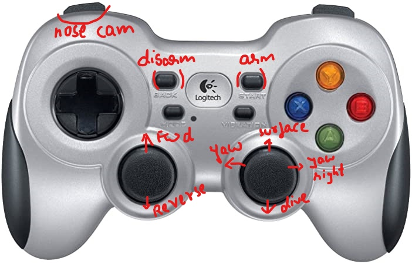
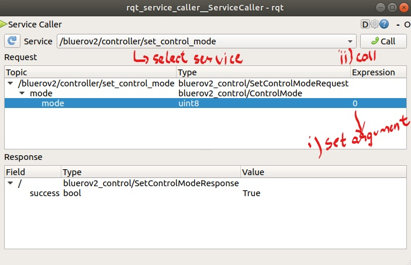
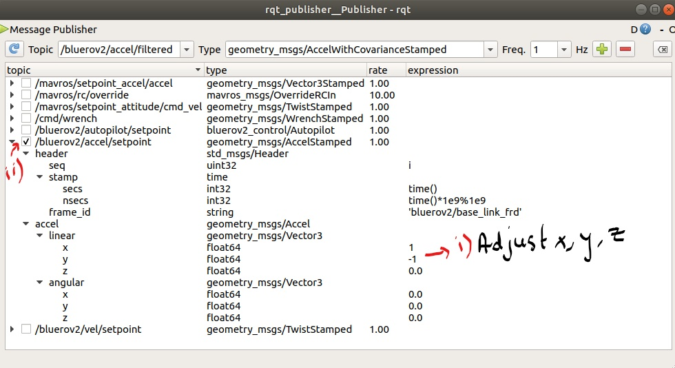

# Summer School Tutorial 1 #

## ROV 2 Start-up and Shutdown ##

The ROV startup and shutdown is simple, 

Just run **launch-rov-v2.desktop** to start up all the ROS nodes and topics.

Similarly, you can run the **stop-rov-v2.desktop** file to terminate all nodes and processes across the ROS system.

Note: These shortcuts will also automatically start and stop recording logs containing telemetry data.

## Manual Control of the ROV ##

Once the ROS connections are active, you will see rviz pop up. It is a 3D visualization tool that displays important information such as the nose_cam video stream, coordinate frames, place markers etc

The launch also pops up two windows - RQT Publisher and RQT Service Caller.

**Joystick controls for manual control**

Once the ROS stack is up and running, we can get started with the joystick. The ROV can be armed using the **start** button and disarmed using the **back** button.

  

## Automatic control modes ##

Now that you have a basic understanding of ROV teleoperation, you can try setting control modes for simple Line Of Sight (LOS) based navigation. 

Refer to **ros_commands** tutorial for some help with basic shell scripting. 

The RQT Service Caller provides a user interface to call arbitrary services to and from certain nodes in the ROS network. In this case, the bluerov2/controller/set_control_mode/ service is called to set different set-point control modes.

  

Argument Control Mode
   0         Off
   1         Idle
   2         AccelTeleOp
   3         VelTeleOp
   4         HoldPosition
   5         AutoPilot
   6         LosGuidance
   7         Abort

Once the desired control mode has been set, the RQT_Publisher can be used to publish messages on the required topic. 

Fx, in case of acceleration setpoint control, the topic would be bluerov2/accel/setpoint.

  

Once the arguments have been published to the topic (remember to check the box for the topic you want to publish to) , the ROV should (fingers crossed) move with the appropriate heading and speed.

