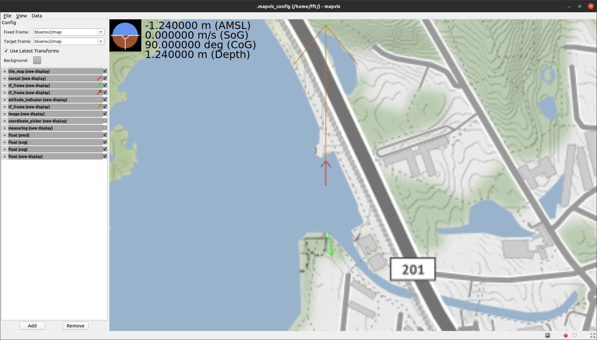

# Tutorial 1: Ardusub SITL #

This tutorial depends on that you have completed installation of Ardusub, ROS Noetic Ninjemys, 
the BlueROV2 packages and their dependencies installed on your system (Ubuntu 20.04). 
If you haven't done this yet, please follow the [setup guide](../GETTING_STARTED.md).

## Launching the simulator ##

In a new terminal (ctrl + alt + t), launch the simulator.

`sim_vehicle.py -v ArduSub -f vectored --map --console -l 55.774255,12.492027,-1,175`

A quick explanation of the optional arguments provided:

**-v Ardusub**: tells the SITL simulator to use the Ardusub binaries.

**-f vectored**: use the 6 motored vectored frame Bluerov2 model.

**--map**: show a reference map.

**--console**: show a console for controlling aspects of the simulator and the proxy service used for mavlink communications.

**-l 55.774255,12.492027,-1,175**: spawn the ROV at latitude 61.442, longitude 10.4242, height above sea level -1 m, and at compass heading 175 (N CW+)

If you want more options, run `sim_vehicle.py -h` to get an extensive description of settings that can be parsed by the simulator.

You should now have something like this:

  

## Launching the BlueROV2 package stack in SITL mode ##

The bluerov2 ROS stack was developed to provide easily extensible offboard control options to the bluerov2.
Since the flight controller unit (FCU) is programmed with a version of Ardusub (currently 4.0.3),
it is also compatible with the SITL binaries provided within the ardupilot ecosystem.

First, in a new terminal (ctrl + alt + t) launch a ROS master node:

`roscore`

Then, in a tabbed terminal (ctrl + shift + t) launch the bluerov2 controller stack:

`roslaunch bluerov2_bringup bringup_bluerov2.launch sitl:=true navigation_aid:=fake joystick_type:=keyboard rviz:=true mapviz:=true dev_mode:=true`

**Hint**: you can add `--ros-args` to the roslaunch command to get a list of arguments available.

Alternative, enter `rosed bluerov2_bringup bringup_bluerov2.launch` to see the entire launch file contents.

A lot of windows will launch, including a terminal with a joystick emulator that reads keyboard presses.

**Activity**: Play around with these controls to control the ROV on the map.

## Explanation of Windows ##

**Keyboard emulator window**: Select this window to have your keyboard presses forwarded to the ROV as joystick commands.

  

**mapviz window**: [mapviz](https://swri-robotics.github.io/mapviz/) mapping visualization tool, handy for fieldwork. 

  

**RViz window**: ROS visualization tool, can visualize all sorts of robot related data (sensors, joints, reference frames, etc.)

  

**Autopilot interface**: A simple GUI to send autopilot cruise, heading and height control commands to the ROV.

  

**Reconfigure window**: Dynamic reconfigure interface used to adjust parameters of nodes.

  

**Publisher window**: Tool to publish messages to topics.

  

**Service Caller window**: Tool to call remote services offered by nodes.

  

**Activity**

1. Arm the ROV via the service caller and the /bluerov2/mavros/cmd/arming service.
2. Set the control mode of the ROV into IDLE mode via the service caller and the /bluerov2/controller/set_controller_state service.
   **Hint**: See the description of the service with `rossrv show bluerov2_msgs/SetControllerState`
3. Publish to the /bluerov2/wrench/target topic with a geometry_msgs/WrenchStamped message to give force commands to the vehicle.
**Hint**: You can input arbitrary python commands from the math and time libraries and an incrementing variable **i** to make your
   commands vary with time.

**Activity**

1. Set the ROV into autopilot mode via the service caller and the /bluerov2/controller/set_controller_state service.
2. Use either the publisher or the autopilot interface to send commands to the ROV.
3. Adjust the parameters in /bluerov2/controller in the dynamic reconfigure window to manually tune the
control response of the vehicle.
   
**Activity**

1. Explore the topics provided in /bluerov2/...
2. Explore other control modes.
3. If you have a USB joystick, you can make your own joystick mapping. See `rosed bluerov2_control switchpro_mappings.yaml`
to see an example. **Note**: You will need to add a symbolic link to your joystick in order to get it registered on the
joy_node. See /etc/udev/99-joystick.rules for examples of automatically generating the symbolic link when you plug the joystick in.
