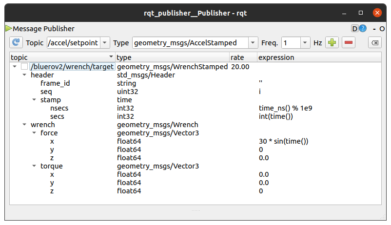

## Tutorial 2: System Identification of BlueROV ##
In this tutorial we will record the motion of the BlueROV in ASTA
whilst commanding the thrusters. We will then use the collected data
to obtain a dynamic model of the vehicle via System Identification methods.

### Interfacing with the BlueROV ###

The BlueROV has been setup to launch a ROS master server and a mavros node upon boot.
There is also a topside laptop connected via ethernet to the ROV, which is streaming OptiTrack
motion capture data on a ROS topic as well as running the BlueROV2 ROS stack that you 
were introduced to in Tutorial 01. The first step for us is to connect to the same network as
the BlueROV, and then configure our environment variables so that we can
also connect to the ROS network, send commands to the BlueROV and record the data.


#### Step one: Connect to the ROV's network ####

A Wi-Fi router has been included to allow all of us to connect to the ROV's network.
Connection details:

```
ssid: aqua_obstek
pass: aqua_obstek
```

#### Step two: Modify your ~/.bashrc file ####

Append the following lines to your ~/.bashrc file:

```
export ROS_MASTER_URI=http://192.168.2.2:11311
export ROS_HOSTNAME=$(hostname).local
```

Then source your modified ~/.bashrc file.

```
source ~/.bashrc
```

Note: You should comment these lines out and re-source you ~/.bashrc
file if you want to connect to a roscore running on your machine's localhost
(like in Tutorial 01).

#### Step three: Test your connection to the network ####

First, see if you can see any topics:

`rostopic list`

You should see a bunch of topics prepended with `/bluerov2`. These are the
topics relayed from the FCU via MAVROS. We are interested in
`/bluerov2/mavros/imu/data` and `/bluerov2/mavros/imu/raw` which provide
orientation, rotational velocity and acceleration measurements in filtered form and raw
sensor form respectively.
You should also see the `/bluerov2/mavros/mocap/pose` topic. This topic contains pose
estimates of rigid body constellations detected within the OptiTrack system. This will
provide absolute position estimates as well as a rotation from the optitrack reference frame,
`bluerov2/map` to the vehicle's body frame (oriented ENU to FLU). These measurements (and derivatives / integrals), will
compose the state measurements of the vehicle motion in Surge, Sway, Heave, Roll, Pitch & Yaw,
in acceleration, velocity and position.

#### Step four: Send a command to the vehicle ####

Now that your computer is on the ROV's ROS network, you can send it commands.

NOTE: It is generally unproductive if everyone tries to send commands to the ROV at once.
Please arrange among yourselves who will have the "hotseat".

In a new terminal, run the following:

`rosrun rqt_publisher rqt_publisher`

In another terminal, run the following:

`rosrun rqt_service_caller rqt_service_caller`

In the service caller GUI, arm the ROV by calling the `/bluerov2/mavros/cmd/arming`
service with a `True` value. This will arm the motors, allowing them to be commanded by
the flight controller to spin.

If the ROV motors start to spin, double check that nobody is sending commands to the ROV by accident.

Next, set the ROV to receive force commands by calling the `/bluerov2/controller/set_controller_state`
service with state value set to 1. This will place the ROV controller into `IDLE` mode,
allowing the motors to be controlled according to body-fixed coordinate frame
commanded forces and torques.

Finally, the ROV is ready to be commanded. In the publisher GUI,
add a topic from the dropdown: `/bluerov2/wrench/target`.

As an example, see the following setup for the message to be published.

<p align="center">
  
</p>

The example creates an oscillating surge command an amplitude of 30 N. You can use any Python
expression from the standard library, as well as the time and math libraries.
Additionally, the variable `i` is reserved as an integer counter that is incremented
everytime the publisher GUI sends a message.

Once you've created the force/torque commands you want, click the checkbox to begin
sending the commands to ROV. It should hopefully start doing something!

**Note**: The roll and pitch (torque X and torque Y) are not yet supported.

**Note**: Make sure to uncheck the box when you are done!

**Note**: Make sure someone has the joystick within arms reach just in case corrective actions are necessary!

#### Step Five: Recording Data ####

Make use of the `rosbag record` node to log the data onto your computer. As an example:

`rosbag record --duration=1m --output-name=rov1_sys_ident.bag /bluerov2/mavros/imu/data /bluerov2/mavros/rc/out /bluerov2/wrench/target /bluerov2/mavros/mocap/pose`

This will record the filtered IMU data, PWM signals to the motors, commanded forces and torques, and OptiTrack position
and orientation measurements for 1 minute into a .bag file located in a file called rov1_sys_ident.bag that is placed within
the working directory of where you executed rosbag.

#### Step Six: Preparing Data for System Identification ####

The system identification methods have been implemented in MATLAB and are expecting synchronised
array data. Our .bag file data is stored asynchronously as the messages arrive. We will have to convert the .bag data into csv form, and then interpolate the data onto a synchronised
time stamp.

Here is a simple way to get data in .csv format:

`rostopic echo -b rov1_sys_ident.bag -p /bluerov2/wrench/target > rov1_sys_ident_wrench_data.csv`

The first column of the csv file is the timestamp when the message was read *from* the .bag file.
Each column afterwards follows values listed in the same order as the description of the message.

For example, `/bluerov2/wrench/target` is of type geometry_msgs/WrenchStamped. We can see the full set of values and their
ordering for the Wrench stamped message by running `rosmsg show geometry_msgs/WrenchStamped`. The columns after the read timestamp should then follow:

`field.header.seq,field.header.stamp,field.header.frame_id,field.wrench.force.x,field.wrench.force.y,field.wrench.force.z,field.wrench.torque.x,field.wrench.torque.y,field.wrench.torque.z`

In this case, the stamp item is the timestamp when the data message was created in ns.
