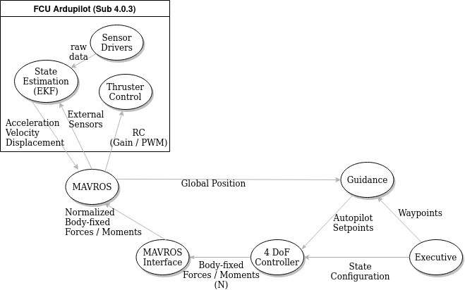
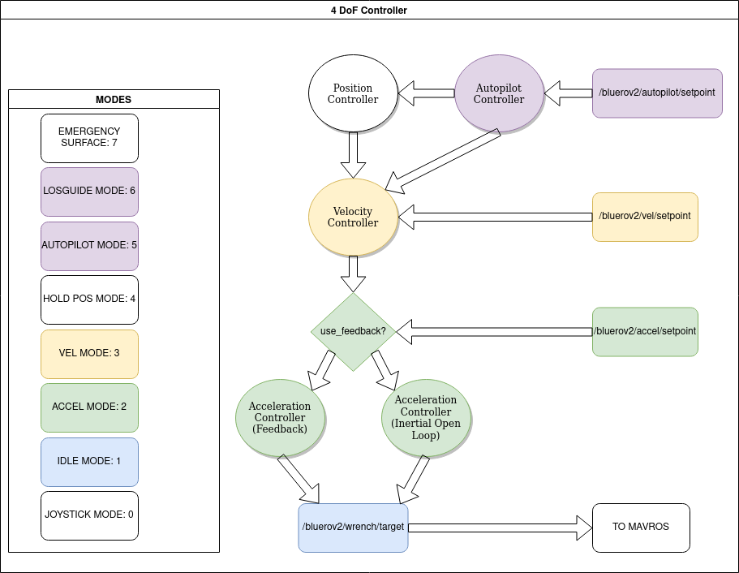

## Tutorial 4: Motion Control ##

In this session you will design a heave controller that controls the 
altitude of the vehicle above the bottom.

### Summary of BlueROV2 control structure ### 

The bluerov2 stack contains several nodes that perform guidance, navigation, and control tasks.
The figure below summarises these key nodes and their relationships.

  

In order from most abstract to least, a brief summary:

**Executive**: A finite-state machine that interfaces the vehicle with mission planning software, shares
waypoint information with the guidance node.

**Guidance**: Performs geodetic calculations given desired waypoints and the vehicle's current position.
Used to calculate LOS bearing error and distance.

**4 DoF Controller**: A configurable Cascade PID controller designed to work in 4 DoF: Surge, Sway, Yaw, Heave (Roll &
Pitch are assumed to be stabilized). Can be configured to control acceleration, or velocity, or autopilot, with additional
modes for holding position (autopilot with 0 speed), emergency surface (vertical motion only), LOS (essentially the same as autoopilot).
Needs state information from navigation software to operate.

**MAVROS Interface**: A script that translates commanded body-fixed forces and moments to a dimensionless gain value used
by the FCU. Also forwards joystick commands to the FCU. (Only forwards when the 4 DoF controller mode is set to OFF, 0).

**MAVROS**: Third party node used to translate ROS messages to/from MAVLINK communication.

**Ardupilot**: Third party software flashed onto the memory of the FCU board, does all low-level sensor reading and motor control.
Also uses an Extended Kalman Filter to obtain a filtered state estimate in position, velocity and acceleration (Note: linear 
acceleration only!)

### Summary of 4 DoF Controller ###

Since we are working on feedback control, we are interested in the 4 DoF controller. In short,
the controller takes setpoints in acceleration, velocity, or position (or a combination depending on the mode) and outputs
on the `/bluerov2/wrench/target` topic. This topic is then used by MAVROS Interface to command the vehicle roughly to follow those
forces (no guarantees!)

  

You can configure the mode of the controller using the service `/bluerov2/controller/set_controller_state`. You should be
already aware of this one.

To see the state of the controller, echo the topic `/bluerov2/controller/state`.

The state enumerates to the mode's described in the figure above and also here.

[The main loop](https://github.com/DTUAqua-ObsTek/bluerov2/blob/70c774d1dc2a50a0f3ea62fc6d09fed284626d29/bluerov2_control/src/bluerov2_control/controllers/cascade_pid.py#L542)
of the controller describes the cascade flow for each mode. Specific mode descriptions are provided below:

**0: OFF**: The controller is off, manual commands from a joystick are forwarded to the FCU.

**1: IDLE**: The controller is not calculating anything, `/bluerov2/wrench/target` topic is forwarded to the FCU.

**2: ACCEL**: [The controller](https://github.com/DTUAqua-ObsTek/bluerov2/blob/70c774d1dc2a50a0f3ea62fc6d09fed284626d29/bluerov2_control/src/bluerov2_control/controllers/cascade_pid.py#L486) either tries to reach a setpoint acceleration by feedback control (only if 
`/bluerov2/controller/use_accel_fb` parameter is true, and something is published to the `/bluerov2/mavros/local_position/accel`,
currently nothing publishes there. Alternatively, the controller converts the acceleration to a force using a specified 
inertia matrix (currently specified in [inertial.yaml](../bluerov2_control/params/controllers/cascade/inertial.yaml)).

**3: VEL**: [The controller](https://github.com/DTUAqua-ObsTek/bluerov2/blob/70c774d1dc2a50a0f3ea62fc6d09fed284626d29/bluerov2_control/src/bluerov2_control/controllers/cascade_pid.py#L433)
listens to `/bluerov2/vel/setpoint` topic and calculates a desired acceleration based on
PID feedback calculated from `/bluerov2/mavros/local_position/odom`. If no external position feedback is provided, then
nothing will publish to `/bluerov2/mavros/local_position/odom`, and so nothing will happen. Otherwise, the calculated
acceleration is then chained into the calc_wrench function and is published from there.

**4: HOLD_POS**: [The controller](https://github.com/DTUAqua-ObsTek/bluerov2/blob/70c774d1dc2a50a0f3ea62fc6d09fed284626d29/bluerov2_control/src/bluerov2_control/controllers/cascade_pid.py#L295)
simply sets an autopilot command of 0 m/s forwards with a desired depth set to the current reading of the depth sensor.
Similarly with the heading. The autopilot command is then propagated to the position controller and velocity controller.

**5: AUTOPILOT**: [The controller](https://github.com/DTUAqua-ObsTek/bluerov2/blob/70c774d1dc2a50a0f3ea62fc6d09fed284626d29/bluerov2_control/src/bluerov2_control/controllers/cascade_pid.py#L315)
calculates the desired velocity vector of the vehicle based on forward speed error, heading error, and either depth or altitude error.
The desired velocity is then passed to the velocity controller, and then subsequently to the acceleration controller.

**6: LOS**: Functionally the same as AUTOPILOT mode, but this is provided to indicate that the vehicle is being managed
by the executive node, who is keeping track of visited waypoints.

**7: ABORT**: [This mode](https://github.com/DTUAqua-ObsTek/bluerov2/blob/70c774d1dc2a50a0f3ea62fc6d09fed284626d29/bluerov2_control/src/bluerov2_control/controllers/cascade_pid.py#L282) either tries to get the vehicle to move heave upwards until it is at 0.5 m depth. Or,
if it doesn't know the depth due to some fault, simply commands the motors to heave upwards with no stop condition.

### Other Useful Services ###

`/bluerov2/mavros/cmd/arming`: Set the FCU to arm (motors spin), or disarm (no spin)

`/bluerov2/mavros/set_mode`: Set the FCU flight mode. Example, setting custom_mode = "2" will place
the ROV in depth_hold mode. Other enums are available [here](https://github.com/DTUAqua-ObsTek/bluerov2/blob/70c774d1dc2a50a0f3ea62fc6d09fed284626d29/bluerov2_control/src/bluerov2_control/controllers/cascade_pid.py#L198-L203)

`/bluerov2/autopilot/set`: Set the autopilot. Height reference should be 'MSL' (altitude above mean sea level),
'DPT' (metres below sea level), or 'BTM' (metres above bottom reading).

### Controlling Altitude ###
You may have noticed that the autopilot controller already has a basic altitude control option (it isn't particularly good).
The goal is to try and make your own altitude controller node.

The rangefinder is published here: `/bluerov2/mavros/distance_sensor/rangefinder_pub`.

Remember to ARM the vehicle and place it in depth_hold mode to maximise stability.

You can adjust the PID controllers for the ROV:

`rosparam list /bluerov2/controller`

You can also use `rqt_reconfigure` to adjust the PID tunings.

You should be able to send desired velocity, acceleration, OR wrench target messages. Just make sure to put the controller
into the correct state.